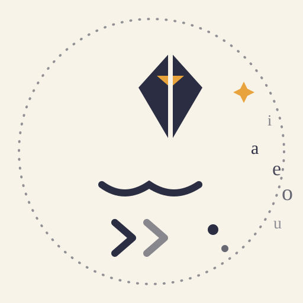

<p align="center">
  
</p>

<h1 align="center">Eunoia (εὔνοια)</h1>

<p align="center"><em>beautiful thinking</em> — a programming language whose code reads like poetry.</p>

<p align="center">
  <a href="README.md">English</a> · <a href="README.ko.md">한국어</a>
</p>

<p align="center">
  
  
  
  
  
</p>

---

## What is Eunoia?

**Eunoia** (from Greek *εὔνοια*, "beautiful thinking / harmonious mind") is a
programming language designed so that opening a source file feels like opening
a book of verse. When you first look at Eunoia code, the hope is that your
first thought is:

> *"Wait... is this a poem?"*

Eunoia is not a toy that *pretends* to be poetry. It is a real interpreter —
written in plain Python, with no dependencies — that turns verse into running
code. Every example in this README actually runs.

---

## Try it in thirty seconds

```bash
git clone https://github.com/spidychoipro/eunoia.git
cd eunoia
python -m venv .venv

# Windows
.venv\Scripts\activate
# macOS / Linux
# source .venv/bin/activate

pip install -e .
eunoia recite poems/hello.euo
```

```text
$ eunoia recite poems/hello.euo
wow
```

That's it. No dependencies, no build step — just Python and your poem.

> **Python version:** Eunoia runs on Python **3.9+** and we recommend using the
> **latest release** you can (3.12 or newer) — that's what the project is
> developed and tested against.

---

## The original idea: a poem, and a poetry collection

Every language hides a bridge between what you write and what the machine does.
Eunoia leans into that bridge — not to be obscure, but to be **beautiful**.

Python calls a source file `.py` and a compiled file `.pyc`. Eunoia turns that
into a metaphor:

| Artifact | Python | Eunoia | Meaning |
|----------|--------|--------|---------|
| Source file   | `.py`  | `.euo`  | a **poem** *(시)* |
| Compiled file | `.pyc` | `.euoc` | a **poetry collection** *(시집)* |

So you don't *run* a file — you **recite** it. When poems are `bind`-ed
together (still on the roadmap), a **poetry collection** is born.

---

## A first poem

`poems/hello.euo`:

```
let wow be "wow"
let hello be wow
whisper hello
```

Every line maps straight to Python:

```python
wow = "wow"
hello = wow
print(hello)
```

More examples:

```
let autumn be "the sky's hue"

let garden be five times six
let share be a dozen over four

whisper autumn
whisper garden
whisper share
speak "I am the poem"
```

```text
$ eunoia recite poems/autumn.euo
the sky's hue
30
3
I am the poem
```

---

## Grammar reference

Eunoia's own grammar has **no parentheses and no symbols** — only words, space,
and a line break at the end of every verse.

### Core statements

| Keyword    | Eunoia line                 | Means                               | Python                       |
|------------|-----------------------------|-------------------------------------|------------------------------|
| `let`      | `let hello be wow`          | give a name a meaning               | `hello = wow`                |
| `whisper`  | `whisper hello`             | print a value, softly               | `print(hello)`               |
| `speak`    | `speak "I am the poem"`     | print a string, aloud               | `print("I am the poem")`     |
| `summon`   | `summon requests`           | install a package from afar         | `pip install requests`       |
| `embrace`  | `embrace requests`          | bring a package into use            | `import requests`            |

### Arithmetic — spoken, not typed

| Operator | Poetic word          | Example                                | Means          |
|----------|----------------------|----------------------------------------|----------------|
| `+`      | `and`, `with`        | `let sum be two and three`             | `sum = 2 + 3`  |
| `-`      | `without`            | `let rest be ten without four`         | `rest = 10-4`  |
| `×`      | `times`              | `let garden be five times six`         | `garden = 5*6` |
| `÷`      | `over`, `shared among` | `let share be a dozen over four`      | `share = 12/4` |
| `%`      | `keeps`              | `let what be twelve keeps five`        | `12 % 5`       |

### Numbers are words

`one` … `twelve`, `thirteen` … `nineteen`, the tens `twenty` … `ninety`, plus
`a`, `an`, `dozen`, `score`, `hundred`, `thousand`, `million`, `billion`.

```
one hundred and five     → 100 + 5 = 105
two dozen over four      → (2 × 12) / 4 = 6
a score and one          → 20 + 1 = 21
```

Multiplication and division bind before addition and subtraction, just like
you'd expect.

### Comments

Lines starting with `#` are quiet — they only speak to the reader, never to
the machine.

```
let hello be "wow"  # a note nobody runs
whisper hello
```

---

## Whisper the soul

Like Python's `import this`, one line calls forth the language's inner creed:

```
whisper the soul
```

```text
$ echo "whisper the soul" > /tmp/the-soul.euo     # or any .euo file
$ eunoia recite the-soul.euo
The Soul of Eunoia

Let each poem be honest,
and each line worth reading twice.

Let the surface be the whole sky;
let the gears turn far below.

Let a name be chosen with care,
for it will be spoken softly many times.

Let simplicity win over cleverness,
let beauty win over noise.

Let the machine kneel quietly,
that the reader may stay in wonder.

Let foreign poets be quoted with respect,
their words set apart by marks.

Let a whisper comfort more than a shout.

Let the poem that runs
still be a poem.

Let errors be a gentle stumble,
not a slammed door.

Let the soul speak in one tongue
while the body serves the whole world.

Let the last line matter.
```

---

## Design principles

1. **The surface is poetry.** The user only ever sees verse. The machine's dull
   work (installing, importing, translating) happens invisibly below the poem.
2. **Simplicity is beauty.** A keyword that does one thing well is more poetic
   than one that does five.
3. **Reads left to right, like a line of verse.**
4. **Under the hood, it is real.** Eunoia compiles to something the machine
   understands — it is not a toy, it is a poem that runs.
5. **Korean soul, universal body.** The ideas are felt in Korean; the machine
   works everywhere.

---

## Packages, invisibly

You never type `pip install`. The poem itself summons:

```
summon requests
embrace requests
```

`summon` quietly does the undignified work of `pip` underneath, and `embrace`
brings the module into your arms — into the poem's world. For libraries whose
APIs are deeply Pythonic, the poem may "quote the foreign poet" — their exact
syntax, set apart like a quotation — as a deliberate escape hatch (still on the
roadmap).

---

## Eunoia vs. Shakespeare

|                 | Shakespeare                        | Eunoia                     |
|-----------------|------------------------------------|----------------------------|
| Inspired by     | theatre / drama                    | lyric poetry               |
| Structure       | acts, scenes, characters, `goto`   | verses, lines, gentle flow |
| Mood            | grand, theatrical                  | quiet, intimate            |
| Feels like      | a play being acted                 | a poem being whispered     |

---

## Project structure

```
src/eunoia/        the interpreter
  lexer.py         turns verse into tokens (words, numbers, operators)
  parser.py        turns tokens into statements
  interpreter.py   makes the poem run
  soul.py          the inner creed, whispered on request
  transpile.py     turns verses into plain Python
  anthology.py     binds and unbinds .euoc collections
  cli.py           recite, translate, bind, unbind, write & chant
  ui.py            the muse — a tiny IDLE for the language (tkinter)
poems/             example poems (.euo) that actually run
tests/             unit tests (python -m unittest)
assets/prompts/    image prompts for the logo and the file icon
assets/icons/      the logo and the .euo file icon, drawn as SVG
```

---

## CLI

| Command                                       | Meaning                                        |
|-----------------------------------------------|------------------------------------------------|
| `eunoia recite <file.euo>`                    | run a poem                                     |
| `eunoia recite <file.euoc>`                   | unfold and recite an anthology                 |
| `eunoia translate <file.euo> [-o out.py]`     | turn a poem into plain Python                  |
| `eunoia bind a.euo b.euo -o c.euoc`           | gather poems into an anthology                 |
| `eunoia unbind c.euoc`                        | open an anthology and read its poems again     |
| `eunoia write`                                | open the muse (a tiny IDLE, tkinter)           |
| `eunoia chant`                                | interactive recitation (REPL)                  |

An anthology (`.euoc`) is compiled but never locked: it keeps every poem word
for word, openly, so `unbind` can always give the verses back.

---

## The muse — write like a poet

`eunoia write` opens a small IDLE for the language: compose a poem on the
left, watch its echo on the right. Reproduces the interpreter exactly, so the
page cannot lie — plus a help menu, `whisper the soul`, open/save for `.euo`
files, line numbers, and Ctrl+Enter to recite.

**One-file app.** Build a single Windows executable with PyInstaller:

```bash
pip install pyinstaller
pyinstaller --onefile --windowed --clean --name eunoia --paths src app.py
# → dist/eunoia.exe
```

`app.py` is a tiny entry point that opens the muse. Drop `dist/eunoia.exe`
anywhere, double-click, and write.

---

## Roadmap

- [x] Repository created
- [x] Name decided: **Eunoia**
- [x] Core grammar confirmed and implemented
- [x] `recite` and `chant`
- [x] `whisper the soul`
- [x] The muse — a tiny IDLE, plus a single-file `eunoia.exe`
- [x] `translate` — poems into plain Python
- [x] `bind` & `unbind` — `.euoc` anthologies, always decodable
- [ ] "Quote the foreign poet" escape hatch
- [ ] Control flow as rhythm (breathe / until / whenever)
- [ ] Neovim plugin
- [x] Real logo & file icon (hand-drawn SVG)

---

## Contributing

This is a design-phase project. Ideas are as welcome as code — poetic keywords,
Korean-flavored metaphors, and naming debate included.

- **A poem fell over?** → [open a bug report](https://github.com/spidychoipro/eunoia/issues/new/choose)
- **A new word to propose?** → [open a word request](https://github.com/spidychoipro/eunoia/issues/new/choose)
- **How everything works** → [CONTRIBUTING.md](CONTRIBUTING.md)
- **Kindness first** → [CODE_OF_CONDUCT.md](CODE_OF_CONDUCT.md)

Both guides live at the repository root, so GitHub also surfaces them in the
right sidebar (Contributing guidelines) when someone opens a new issue or pull
request. And before anything else: `whisper the soul`.

---

## License

MIT